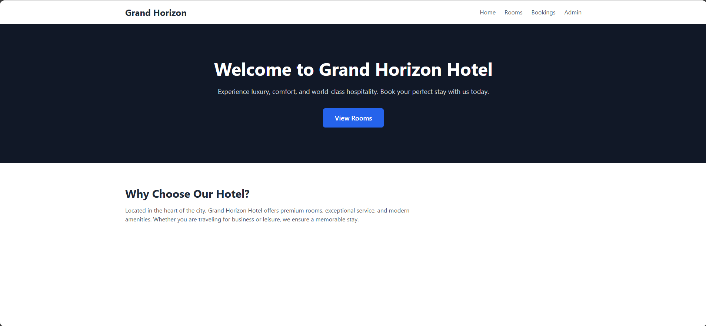
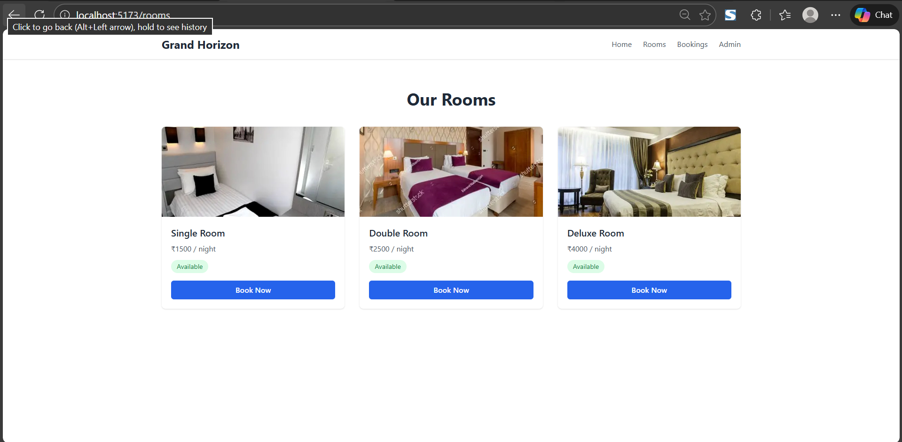
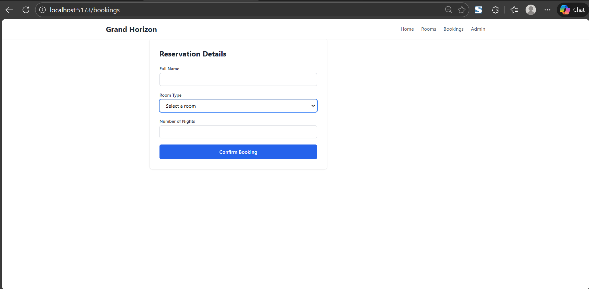
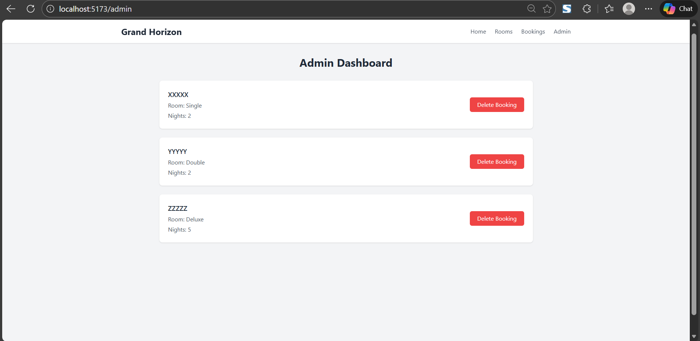

# Hotel Management Webpage

This is a front-end hotel management application built as a learning project using React.
The goal of this project was to design a realistic hotel booking interface and implement
basic booking management without using a backend.

The application allows users to view hotel rooms, make a booking, and manage bookings
through an admin page. All data is stored in the browser using LocalStorage.

---

## What this project includes

- A hotel-style landing page
- Room listing page with images and availability status
- Booking form with validation
- Admin dashboard to view and delete bookings
- Responsive UI built using Tailwind CSS

---

## Tech used

- React (Vite)
- Tailwind CSS
- JavaScript (ES6)
- Browser LocalStorage
- Git and GitHub

---

## Screenshots

Home page  


Rooms page  


Booking page  


Admin dashboard  


---

## How to run locally

1. Clone the repository  
   ```bash
   git clone https://github.com/kishore0786k/Hotel_management_webpage.git
